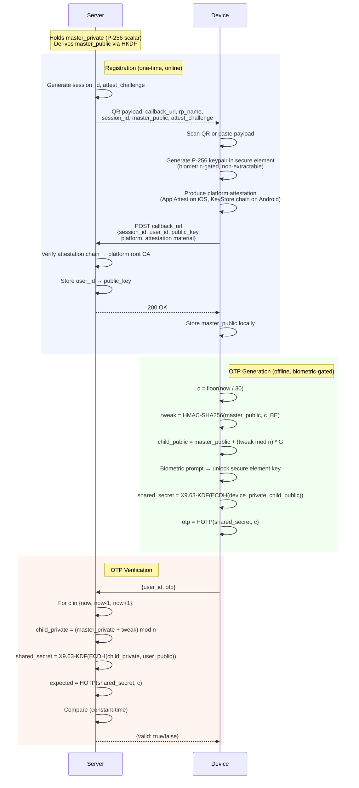

# BIOTP

Biometric One-Time Passwords with hardware-bound key agreement.

BIOTP replaces the symmetric shared secret in TOTP ([RFC 6238](https://www.rfc-editor.org/rfc/rfc6238)) with per-time-step ECDH key agreement. The device private key lives in a secure enclave and is gated on biometric authentication. The server stores only public keys.

The result is a standard 6-digit OTP that is device-bound, biometric-gated, generated offline, and verifiable without any per-user secrets on the server.

See [`rfc-biotp.txt`](rfc-biotp.txt) for the full protocol specification.

<p align="center">
  
</p>

## Why BIOTP

The core problem BIOTP solves is **remote biometric liveness**. A server needs to know that a (specific) human is physically present at a specific device.

Today there is no standard way to get this guarantee. Passkeys prove device possession but the biometric check is local and invisible to the server. TOTP proves knowledge of a shared secret that can be copied to any device.

BIOTP closes this gap:

- **Per-operation biometric proof.** Every OTP generation requires a live biometric authentication (Face ID, Touch ID, fingerprint) enforced by the device's secure hardware. The server doesn't just trust the app to check — on Android, the KeyStore attestation cryptographically proves that the TEE requires biometric authentication before every key use.
- **Non-transferable device binding.** The private key lives in the Secure Enclave (iOS) or StrongBox/TEE (Android). It cannot be exported, backed up, or cloned. There is no seed phrase, no QR code to screenshot, no way to move the credential to another device. If you have a valid OTP, you physically touched the enrolled device with the enrolled finger.
- **Attestation-verified hardware.** At registration, the server verifies the device attestation chain back to Apple or Google root CAs, confirming the key was generated in genuine secure hardware.
- **Server stores no user secrets.** The server holds only public keys and its master key. A database breach leaks nothing an attacker can use to impersonate a user. The ECDH construction means the shared secret is ephemeral and never stored by either side.

To make this work offline, BIOTP introduces a novel cryptographic construction: **deterministic ECDH child key derivation**. The server holds a single P-256 master key pair and derives a fresh child private key for each 30-second time step using an HMAC-based tweak — similar to non-hardened BIP-32 hierarchical deterministic wallets in Bitcoin. The device independently derives the matching child public key from the server's master public key alone, without any communication. Both sides perform ECDH to arrive at the same ephemeral shared secret and feed it into HOTP. The shared secret is never stored — it exists only for the instant of OTP computation and is different every 30 seconds.

The result is a standard 6-digit code that serves as a cryptographic proof of biometric liveness — the person enrolled on this device was physically present within the last 30 seconds.

## Repository Structure

The libraries (`lib/`) implement the BIOTP protocol. The apps and server are **reference implementations for demonstration purposes only** — they are not hardened for production use and exist to show how the protocol works end-to-end.

```
lib/
  biotp-swift/  Swift package — P-256 child key derivation, HOTP
  biotp-kotlin/ Kotlin/JVM library — same, using BigInteger
  biotp-ts/     TypeScript package — server-side master key, OTP, attestation
  biotp-py/     Python package — same as biotp-ts
app/
  ios/          Demo iOS app (SwiftUI, Secure Enclave, App Attest)
  android/      Demo Android app (Jetpack Compose, KeyStore, BiometricPrompt)
server-ts/      Demo Express server (registration, attestation, OTP verification)
```

## Protocol



## Quick Start

### Prerequisites

- Node.js 22+ (server)
- Xcode (iOS app)
- Android Studio or Gradle + Android SDK (Android app)
- Optional: `ngrok` for real-device testing

### Server

```bash
just server-setup   # install deps, build TypeScript
just server         # run on http://localhost:8787
```

For emulator/simulator testing (skips attestation verification):

```bash
just server-dev
```

For real-device testing over the internet:

```bash
just server-ngrok
```

### iOS App

```bash
just ios-open       # open Xcode project
just ios-build      # build from command line
```

Run on a physical iPhone for Secure Enclave + Face ID. Simulator works without biometrics.

### Android App

```bash
just android-setup  # generate Gradle wrapper
just android-build  # build debug APK
just android-run    # build, start emulator, install, launch
```

The emulator works without biometrics. A physical device uses fingerprint/face to gate each OTP.

## Environment Variables

Set before `just server` or `just server-ngrok`.

| Variable          | Description                                                                                                             |
| ----------------- | ----------------------------------------------------------------------------------------------------------------------- |
| `MASTER_SECRET`   | 32-byte hex seed. Random if unset.                                                                                      |
| `PUBLIC_BASE_URL` | Base URL for QR payloads. Auto-set by `just server-ngrok`.                                                              |
| `ALLOWED_APP_IDS` | Comma-separated list of `TEAMID.BUNDLEID` strings for iOS App Attest rpIdHash enforcement.                              |
| `ALLOW_SIMULATOR` | Set to `1` to accept registrations without valid attestation or biometric enforcement (for emulator/simulator testing). |
| `DATABASE_URL`    | PostgreSQL connection string. If unset, users are stored in memory.                                                     |

`just server-ngrok` defaults to `ALLOWED_APP_IDS=PNXHZNX557.com.ps.humancheck.HumanCheck` if not set.

## Attestation

BIOTP supports platform-specific device attestation during registration:

- **iOS**: Apple App Attest (DCAppAttestService). CBOR attestation object with x5c certificate chain verified back to the Apple App Attestation Root CA.
- **Android**: KeyStore Key Attestation. X.509 certificate chain with the key attestation extension (OID `1.3.6.1.4.1.11129.2.1.17`) verified back to a Google hardware attestation root.

The server dashboard displays the full parsed certificate chain for each registered device, with per-link signature validation status.

## Server Endpoints

| Method | Path                    | Description                                    |
| ------ | ----------------------- | ---------------------------------------------- |
| `GET`  | `/`                     | Web dashboard                                  |
| `GET`  | `/how-it-works`         | Protocol details page                          |
| `GET`  | `/key`                  | Current derived child public key (debug)       |
| `POST` | `/register/start`       | Create registration session, return QR payload |
| `GET`  | `/register/status/<id>` | Poll registration status                       |
| `POST` | `/register/complete`    | Device submits public key + attestation        |
| `POST` | `/verify`               | Verify a 6-digit OTP                           |
| `GET`  | `/users`                | List registered users                          |

## Justfile Targets

| Target             | Description                            |
| ------------------ | -------------------------------------- |
| `server-setup`     | Install deps, build TypeScript         |
| `server`           | Run server                             |
| `server-dev`       | Run server with `ALLOW_SIMULATOR=1`    |
| `server-ngrok`     | Run server behind ngrok tunnel         |
| `ios-open`         | Open Xcode project                     |
| `ios-build`        | Build iOS app                          |
| `ios-test`         | Run iOS tests                          |
| `android-setup`    | Generate Gradle wrapper                |
| `android-build`    | Build Android debug APK                |
| `android-run`      | Build, start emulator, install, launch |
| `lib-swift-build`  | Build biotp-swift package              |
| `lib-kotlin-build` | Build biotp-kotlin library             |
| `lib-ts-build`     | Build biotp-ts package                 |
